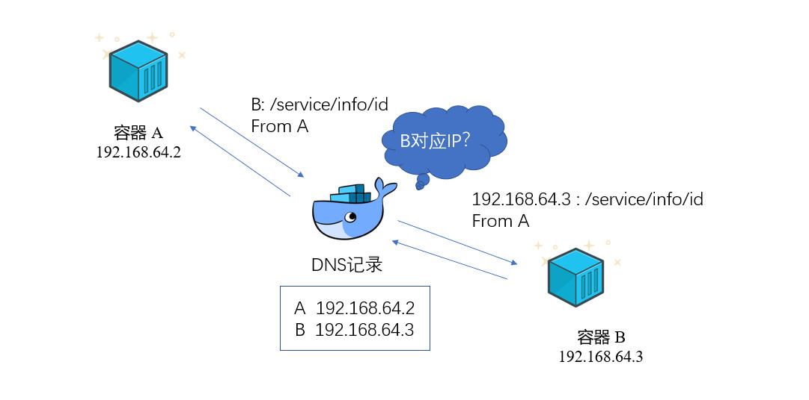

# Docker 容器间访问

## Docker的网络模式

Docker有五种网络模式，各有各的适用场景。大部分时候适用bridge。

- bridge，默认的模式，适合在一个docker宿主机中互相通信；
- host，容器适用宿主机的网络，其他资源与宿主机隔离；
- overlay，适合多个docker宿主机之间的容器间通信；
- macvlan，每个容器分配一个MAC地址，使容器类似于虚拟机；
- Third-party network plugins，允许docker与其他的网络结合。

## Docker DNS Server

一个容器是一个微服务，单个容器往往无法提供一个整体的服务，所以需要多个容器互相协作，互相访问，从版本1.10开始，docker开始内置DNS Server，有了DNS的支持，容器间互相访问可以通过名称进行，否则得指定IP地址。那么通过名称互相访问有什么好处吗？

我们知道，从某种意义上讲，容器是不稳定的，可能因为程序的退出而退出，如果重新启动不指定IP那么其IP可能会变动，所以一个容器挂掉后，重启必须指定IP地址，例如`docker run --ip 192.168.30.123`，但是IP不容易记忆，管理一堆IP并不是我们所擅长的。我们可以交给DNS来管理，docker内置了一个dns server，默认IP是`127.0.0.11`。我们知道，dns作用就是名称和IP的映射，所以如果在容器启动时指定名称，即可在A容器中通过容器名称访问到容器B。



## 实例

启动容器A，docker engine会自动附加dns server地址，我们可以通过查看容器解析规则： `docker exec A cat /etc/resolv.conf`，结果如下。可见已经给每个容器配置了dns server（127.0.0.11）:

```
nameserver 127.0.0.11
options timeout:2 attempts:3 rotate single-request-reopen ndots:0
```
