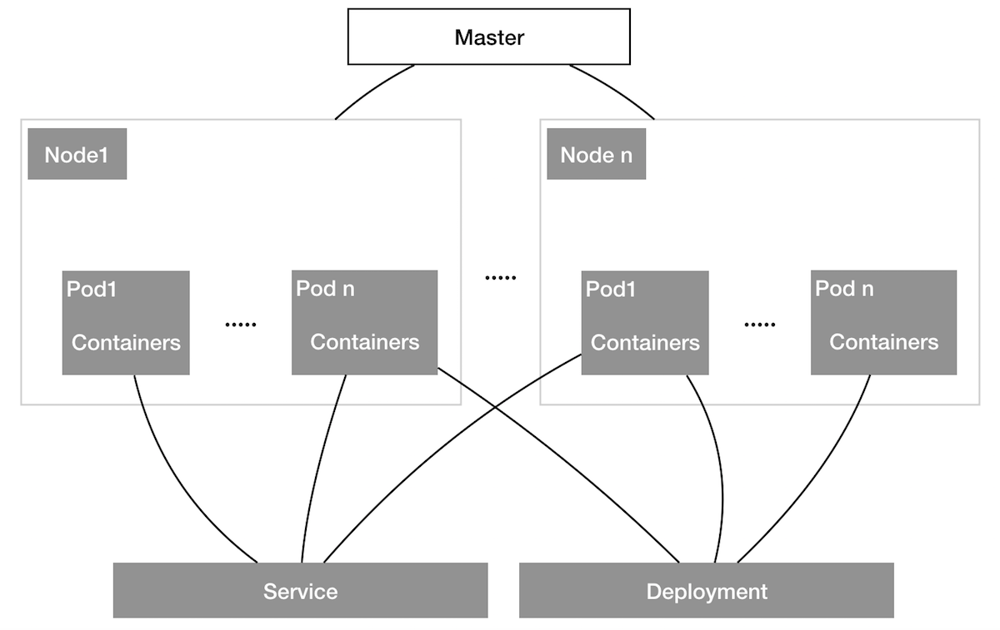
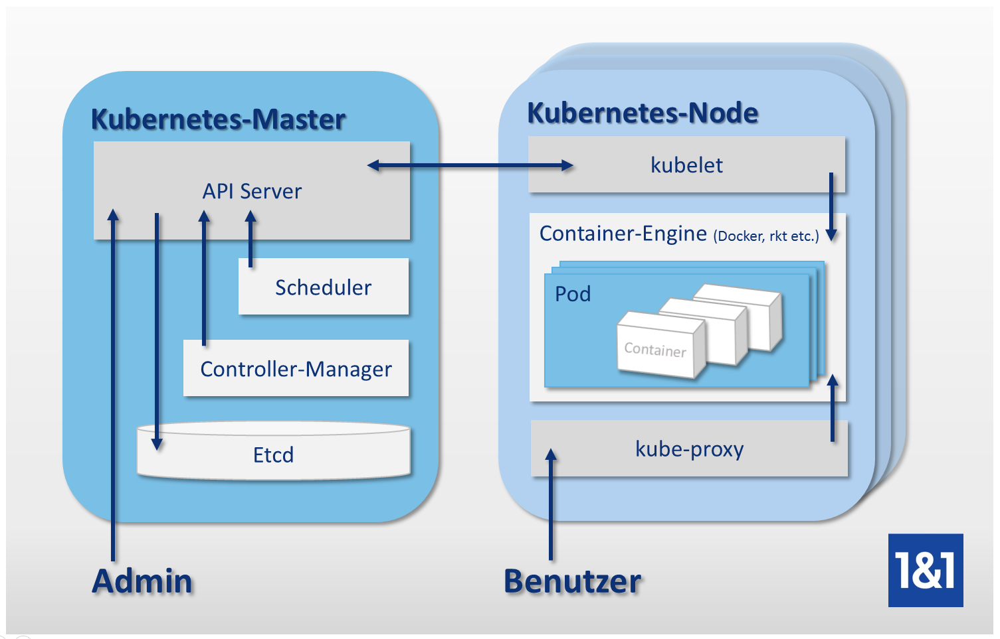

# Kubernetes

Kubernetes是容器编排工具，所谓容器编排，就是对容器进行调度和管理，Kubernetes管理多个虚拟机节点，把容器按照一定的规则分配到各个节点，同时对容器的生命周期进行管理，也就是说当容器由于某种原因挂掉，Kubernetes负责重新启动一个相同容器替代挂掉的容器，使相同的容器实例数量始终保持一定的数量，从而保证服务一直处于可用的状态。

在Kubernetes集群中，可以根据流量情况，手动增减应用规模，或者设定容器对资源使用的阈值，当容器超过阈值，自动增加副本来缓解压力。

为了达到对容器的调度和管理的目的，Kubernetes定义了很多抽象对象，用以更好的管理集群资源：

- Service，一组相同容器副本对外的出口，可以理解为微服务，背后带负载均衡；
- Deployment，管理一组容器副本，使其在任何时候都保持规定的数量，从而达到服务高可用的状态；
- Pod，与容器一对一，Kubernetes中的最小管理单元，Pod为在其内的容器提供网络和存储等基础设施。

## 一、资源对象

图1 Kubernetes资源关系

Kubernetes中有许多概念：Pod、Deployment、Service、Node和Namespace，这些概念都是逻辑上的抽象，主要为了方便管理和自动化，而每个pod可能有相关联的、Volume和Network。

### 1.1 namespace

Namespace和编程语言中的namespace作用一样，是一个隔离的作用，类似于一个独立的环境，这个环境中可以运行Kubernetes中的其他资源，注意，Kubernetes中的资源都是跟一个namespace绑定的，默认是`default`。

### 1.2 Node

在Kubernetes集群中的每台虚拟机或物理机都称为node，Kubernetes的主进程（Master）往node调配任务，安装应用。Node配置好参数，可以在启动时自动加入Kubernetes集群，Kubernetes检测到新的Node节点，就会将其资源加入资源池，等待使用。Kubernetes会检测每个node的安全状况，发现node失联，便会将部署在失联node上的应用迁移到其他的可用节点，这里就靠Kubernetes的调度器发挥作用，这一切都是自动完成。

### 1.2 Pod

Pod是Kubernetes管理和部署的最小单元，可以理解为一个微服务，类似于docker中的容器，不过粒度更大，一个Pod往往封装一个或多个紧密耦合的容器，多数为一个。pod是一个正常工作的最小单元，类似于麻雀（麻雀虽小，五脏俱全），一般包含共享存储，专用的网络，在一个Pod中的多个容器可以使用localhost互相访问，这在docker容器里可是做不到的。

### 1.3 Deployment

Deployment，就是部署，也就是说它管理部署有关的一切，比如Pod的启动，调度，失败重启，规模扩展和缩小，它可以保证任何情况下都有足够数量的正常容器在运行。所以我们一般是通过Deployment对象来启动Pod中的容器，这样我们的Pod就可以得到Deployment的管理和监控。

### 1.4 Service

Service的作用就是对外暴露服务接口，接口后面对应的是多个具有相同作用的Pod，Service接收到请求，可以将请求转发给后端的任一Pod，类似于负载均衡。Service暴露服务的方式有很多种，有：ClusterIP、NodePort、LoadBalance、Ingress，ClusterIP是集群内可以访问的服务，集群外不能访问，是默认行为；NodePort是指通过虚拟机或物理机的IP:Port的方式可以访问；LoadBalance拥有一个单独的IP，LoadBalance作为Service对外的代理，访问的LoadBalance都是访问Service，这种方式要给每个LoadBalance配置一个单独的IP；Ingress可以说是一种虚拟技术，它将对路径访问转换为对Service的访问，类似于Nginx。

### 1.5 Volume

容器可能要保存文件，这些文件可能比较重要，需要保存，而容器一旦crash，那么里边的文件就都没有了，所以我们要像docker的volume一样，提供Pod对外的映射Volume。Kubernetes的volume有多种，比较常用的是PV（Persistant Volume）。

### 1.6 Network

对于一个分布式架构的容器集群来说，一个非常重要的基础设施就是通信渠道，Kubernetes并没有内置提供，而是假设网络需求已经被满足。换句话说，就是需要你自己搭建集群通信的网络，保证Pod与Pod通信，Pod与Service通信线路是畅通的。通常的解决方案是Flannel和etcd。

## 二、结构概念

图2 Kubernetes集群拓扑结构（来自网络）

最简单的Kubernetes集群是一主（Master）多从（Node）的拓扑结构，Master节点需要安装API Server，API Server是Kubernetes的中枢，类似于人类大脑，它接受用户指令，控制集群，并接受集群的反馈；etcd（一个分布式键值对存储，类似Redis）存储集群各个节点资源状态；Scheduler是Kubernetes的调度器，启动应用应该如何分配到各个Node都是它的作用；Controller Manager管理各个Controller，Controller有很多种，用于管理各种资源，比如管理Node的叫Node Controller，管理部署Pod的Replication Controller等。

Node节点主要安装Flannel和Docker，Docker不用说，就是为了提供容器的运行环境，当然你可以用rkt；Flannel则负责为Pod间访问提供支持，它在集群中为每一个Pod分配一个独一无二的IP地址，这样Pod之间可以跨节点访问了。

## 总结

Kubernetes有一套自己的概念体系，刚开始上手比较难，尤其对网络和存储等概念理解不深，安装过程可以参考<https://jimmysong.io/kubernetes-handbook/practice/install-kubernetes-on-centos.html>，完成集群搭建并掌握Kubernetes后你可以得到：

- 服务高可用，任意时刻应用总是保持一定数量的副本数；
- 服务规模自动伸缩能力；
- 单个Pod、单个节点crash不会影响线上服务可用性。